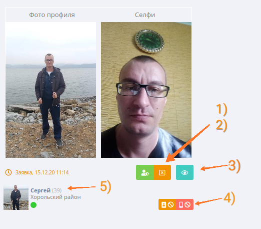

# Пример и стили компонента



За расположение элементов на мобильных устройствах отвечаете вы.

Максимальная ширина всей карточки: ``` max-width: 380px;```

1) Кнопка верифицировать пользователя
   
   **Иконка:** fas fa-user-shield
   
   **Цвет:** #6DBB4A
   
   **Размер:** btn-sm
   

2) Кнопка отклонить верификацию
   
    **Иконка:** far fa-window-close
   
    **Цвет:** #E48800
   
    **Размер:** btn-sm
   

3) Кнопка открыть фотографии в увеличенном масштабе.
Открываются сразу 2 фотографии.
   
    **Иконка:** far fa-eye
   
    **Цвет:** #41CAC0
   
    **Размер:** btn-sm


4) Две кнопки: забанить аккаунт и забанить устройство соответственно.

    **Стили:**
       
    ```css
    .btn-group-ban {
        padding: 1px 5px;
        font-size: 12px;
        line-height: 1.5;
        border-radius: 3px;
    }
    ```
+ Забанить аккаунт
  
    **Иконки:** fas fa-portrait, fas fa-ban
   
    **Цвет:** #E48800
   
    **Размер:** btn-sm


+ Забанить устройство
  
    **Иконки:** fas fa-mobile-alt, fas fa-ban
   
    **Цвет:** #EC6459
   
    **Размер:** btn-sm

5) Информация о пользователе

    ```css
    .user-name {
        color: #667fa0;
    }
   .user-years{
       color: #aaa; 
   }
   .user-avatar{
        flex: 50px 0 0;
   }
   .user-location-text{
        color: #797979;
   }
    ```
   
6) Текст заявки 
   
    **Цвет:** #E48800


7) Фото профиля и селфи.
   Фотографии должны отображаться полностью, то есть не обрезаться с центрированием.

    ``` max-height: 270px;```
    ``` max-width: 186px;```

    
